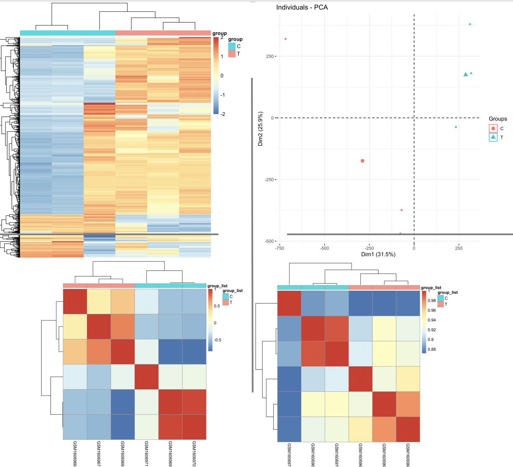
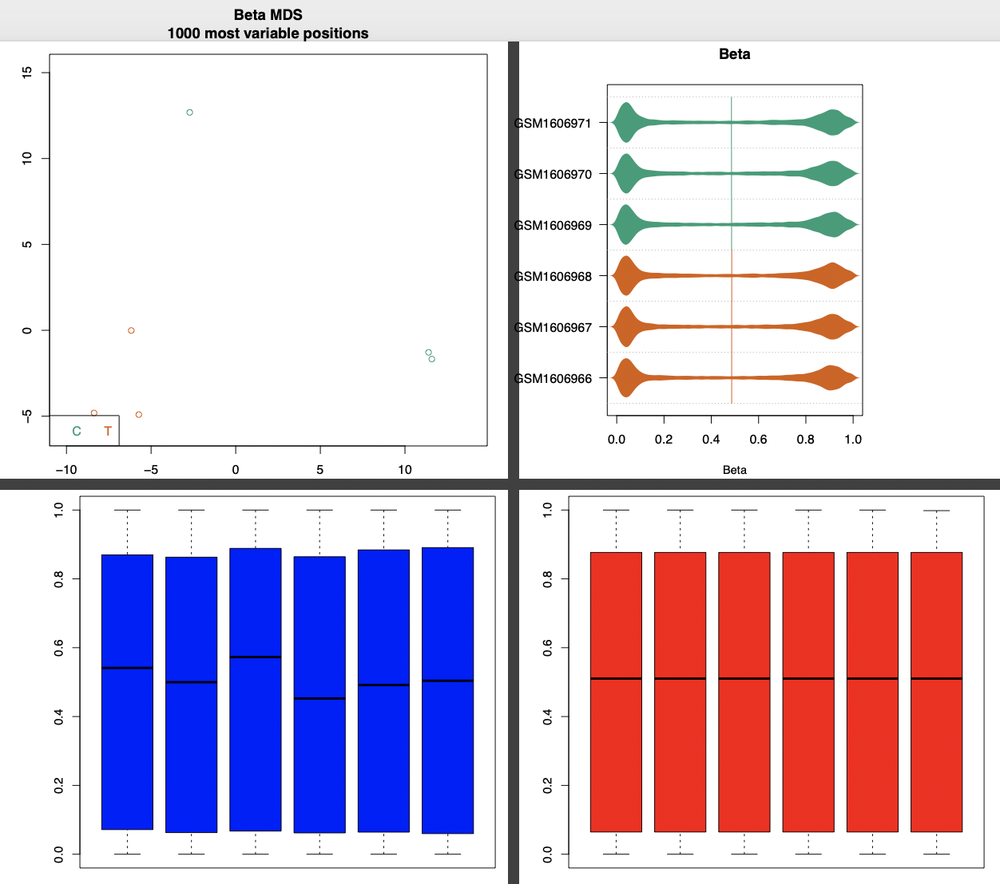
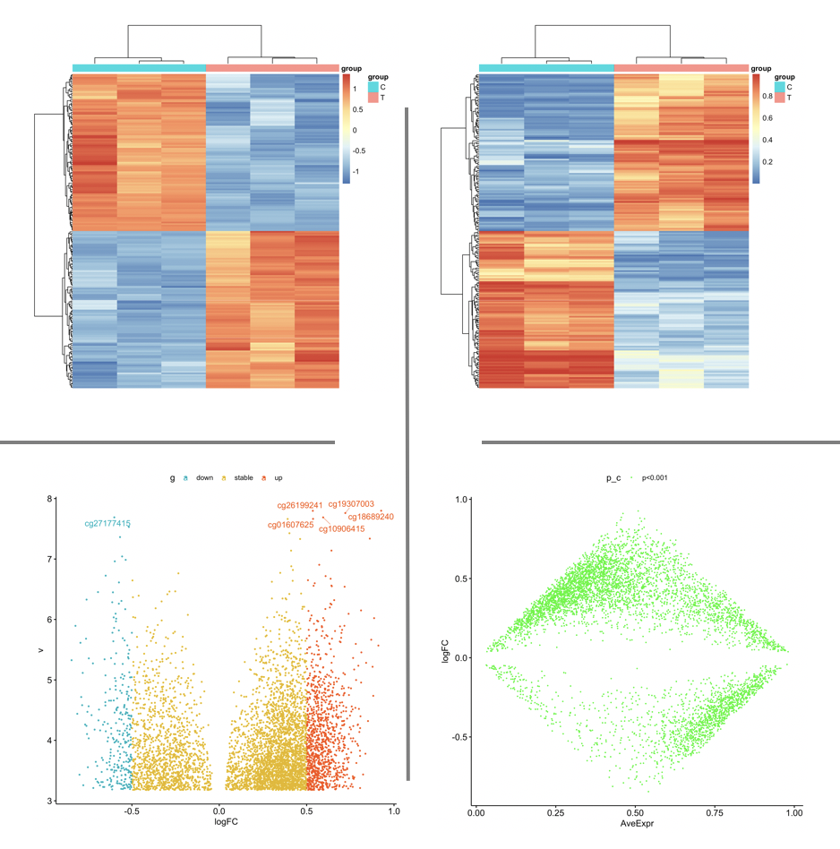
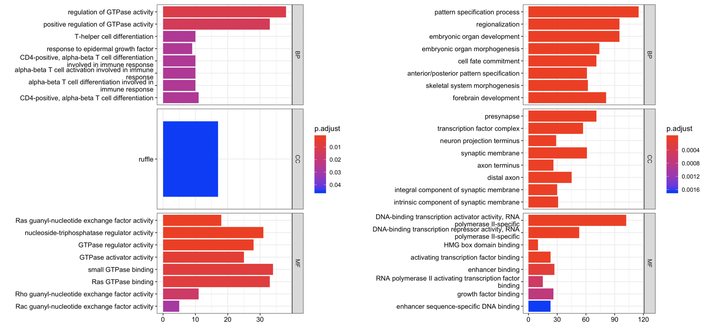

#一个甲基化芯片信号值矩阵差异分析的标准代码

本来呢，我的GitHub已经有一个GEO项目了，上面罗列了我大量的表达矩阵数据分析代码，理论上这个甲基化芯片信号值矩阵差异分析也是属于GEO公共数据库挖掘。

但是呢，甲基化芯片信号值矩阵差异分析里面的代码细节有点多，不同于以前我们分享的普通表达矩阵数据分析，还是值得重新开一个项目来描述它。背景知识大家需要自行查看我在生信技能树的推文哦，介绍在：[甲基化的一些基础知识](https://mp.weixin.qq.com/s/-E50Jvzo8aNqVgvEB0nVGA)，也了解了[甲基化芯片的一般分析流程 ](https://mp.weixin.qq.com/s/JHrL_DqgQY6Yh18vHySKYg) 。

然后下载了自己感兴趣的项目的每个样本的idat原始文件，也可以简单通过**minfi包或者champ**处理它们拿到一个对象。

- [甲基化芯片数据下载的多种技巧](https://mp.weixin.qq.com/s/enToXyxrktUlPHONDnhRFw)
- [甲基化芯片数据下载如何读入到R里面](https://mp.weixin.qq.com/s/-isBJQNTKu4oD5ZVLKU33A)
- [甲基化芯片数据的一些质控指标](https://mp.weixin.qq.com/s/VtuapPafKsZaS_WKuQx4Xg)

注意：这个GitHub文件夹全套代码，你下载如果有困难，需要学一学科学上网哈！

### step0：安装常见的R包

看这个代码，你肯定是会R语言的，下面几个R包，安装起来，至少四五个小时哈

```r
# 
# 中间肯定会报错，自己机智一点哦
BiocManager::install("minfi",ask = F,update = F)
BiocManager::install("ChAMP",ask = F,update = F)
BiocManager::install("methylationArrayAnalysis",ask = F,update = F) 
BiocManager::install("wateRmelon",ask = F,update = F) 

```

起码耗费你几个G的电脑硬盘存储空间哦。电脑配置比较低的朋友可以走了，甲基化不是你玩的起的哈。

### step1：读入基化芯片信号值矩阵

### 如果是idat原始芯片挖掘

采取minfi或者champ流程读入均可，见[甲基化芯片数据下载如何读入到R里面](https://mp.weixin.qq.com/s/-isBJQNTKu4oD5ZVLKU33A)

#### 如果是甲基化信号值矩阵文件

这里举例的  group.txt 和 data.txt 是自己截图的6个甲基化芯片数据，2个分组，方便走差异分析流程。任何一个GEO的数据集，都可以自行这里  group.txt 和 data.txt 文件，我们的 [step1-load-betaM.R](./step1-load-betaM.R) 代码很齐全啦：

```r
info=read.table("group.txt",sep="\t",header=T)
library(data.table)
# 如果你的甲基化信号矩阵，自己在Excel表格里面整理好。
# 就走下面的fread流程
a=fread("data.txt",data.table = F ) 
a[1:4,1:4]
rownames(a)=a[,1]
a=a[,-1]
beta=as.betarix(a)
beta=impute.knn(beta)
betaData=beta$data
betaData=betaData+0.00001
a=betaData
a[1:4,1:4]
identical(colnames(a),rownames(b))

library(ChAMP)
# beta 信号值矩阵里面不能有NA值
myLoad=champ.filter(beta = a,pd = b)
myLoad
save(myLoad,file = 'step1-output.Rdata')
```

如果是GEOquery 流程，取决于你自己的需求哈，代码是：

```r
# 如果你使用GEO数据库下载甲基化信号值矩阵文件 
# 下面的代码你也需要理解哦。
if(F){
  require(GEOquery)
  require(Biobase)
  eset <- getGEO("GSE68777",destdir = './',AnnotGPL = T,getGPL = F)
  beta.m <- exprs(eset[[1]]) 
  ## 顺便把临床信息制作一下，下面的代码，具体每一个项目都是需要修改的哦 
  pD.all <- pData(eset[[1]])
  pD <- pD.all[, c("title", "geo_accession", "characteristics_ch1.1", "characteristics_ch1.2")]
  head(pD)
  names(pD)[c(3,4)] <- c("group", "sex")
  pD$group <- sub("^diagnosis: ", "", pD$group)
  pD$sex <- sub("^Sex: ", "", pD$sex) 
  
  library(ChAMP)
  # beta 信号值矩阵里面不能有NA值
  myLoad=champ.filter(beta = beta.m ,pd = pD)
  myLoad
  save(myLoad,file = 'step1-output.Rdata')
}

# 两种方法，都是为了制作 champ 的对象
# 后续分析，使用这个myLoad变量即可

```

主要是因为 GEOquery的getGEO函数下载甲基化信号值矩阵，在中国大陆基本上是失败的，网速太难了。

### step2 : 甲基化信号值矩阵质量检测

我们的代码：[step2-check-betaM.R](./step2-check-betaM.R) 很齐全啦，有生信技能树独创的3张图，如下：



可以很明显从PCA图看的两个分组的样本还是相距足够远，生物学分组的意义是合理的，但是呢，选取top1000的sd的探针，可以看到其中一个样本被混入到不属于它的组别里面了，这个问题，在样本相关性矩阵热图里面也可以得到反映！

也有一个过气的质量控制图表：



这个主要是看2个组的6个样本的甲基化信号值分布情况，通常不看这个，有统计学基础的朋友很容易看得到啦！

### step3：差异分析

这个时候也有两个策略，走champ流程或者minfi流程。

```r
load(file = 'step1-output.Rdata')
myLoad  # 存储了甲基化信号矩阵和表型信息。
myNorm <- champ.norm(beta=myLoad$beta,arraytype="450K",cores=5)
dim(myNorm) 
group_list=myLoad$pd$Group
table(group_list)
myDMP <- champ.DMP(beta = myNorm,pheno=group_list)
head(myDMP[[1]])
save(myDMP,file = 'step3-output-myDMP.Rdata')
```

### step4: 比较champ流程或者minfi流程结果

```r
load(file = 'step1-output.Rdata')
beta.m=myLoad$beta
# 后续针对 beta.m 进行差异分析, 比如 minfi 包
grset=makeGenomicRatioSetFromMatrix(beta.m,what="Beta")
M = getM(grset)
# 因为甲基化芯片是450K或者850K，几十万行的甲基化位点，统计检验通常很慢。
dmp <- dmpFinder(M, pheno=group_list, type="categorical")
dmpDiff=dmp[(dmp$qval<0.05) & (is.na(dmp$qval)==F),]
dim(dmpDiff)

load(file = 'step3-output-myDMP.Rdata')
champDiff=myDMP[[1]]

dim(dmpDiff)
dim(champDiff)
length(intersect(rownames(dmpDiff),rownames(champDiff)))
```

可以看到champ流程或者minfi流程差异分析结果的overlap还算不错。

但是，我们肯定选择champ流程啦！

进行一系列差异分析结果可视化，火山图，MA图， 热图等等。如下：



### step5：GO或者KEGG等数据库的功能注释

因为champ流程拿到的差异分析结果里面的甲基化探针，自动会注释到了基因，所以容易进行GO或者KEGG等数据库的功能注释。



其实还可以进行甲基化位点的分类，因为位于基因组不同功能区域的甲基化探针信号值代表的生物学意义不一样，包括5’ UTR, first exon, gene body, 3’ UTR, CpG island, CpG shore, CpG shelf，这些注释，都是在厂商提供注释文件信息里面。所以差异分析拿到的高甲基化或者低甲基化位点就可以分类。同理，champ也自动注释啦。

### step6：一些高级可视化

其实主要是利用了Y叔的5个可视化函数，代码见：[step6-visualization.R](.step6-visualization.R)

### step7: 一些个性化分析

这个代码就很自由了。